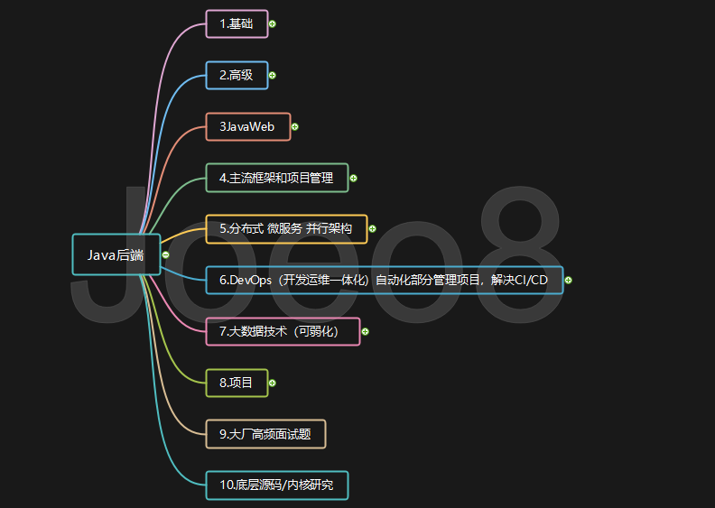

## Java Learning Collection

>1. Javase:java基础，既然是基础，那肯定是最重要的，所以学习的时候也是需要重点学习的地方。
>
>2. 数据库：为什么要学数据库呢，因为我们的web数据需要持久化到磁盘上统一管理，而数据库无疑就是最好工具。目前主流的关系型数据库有mysql 和oracle。我建议先学mysql。为什么呢mysql相比Oracle难度要低，而在国内应用场景又是最多的。
>
>3. 前端基础：既然是做一个网站，那肯定不能是后台的数据，这样用户也是没办法看的，所以需要学习前端知识，把数据展示到页面上，而对于后台人员来说，学习阶段只需要学习前端基础就可以了。Html 、js、css、jquery就可以了。当然到离开后期你也可以学学专门为后端人员定制的前端框架，比如，layui，easyui。如果还觉得不够可以学学前端专用框架。比如vue element ，但是大前提是把自己的后台学到位了再学其他的。
>
>4. Javaweb：jsp、servlet。为什么用了html还要学jsp呢。因为jsp和Java是无缝连接的。学了javaweb以后就可以自己做一个项目出来了，比如你想做一个个人网站。你可以给你们学校做一个教务管理系统都是可以的。
>
>5. Spring：后台框架。为什么要用框架呢，可以快速开发，并且降低了耦合。Spring的AOP支持允许将一些通用任务如安全、事务、日志等进行集中式管理，从而提供了更好的复用，Spring的ORM和DAO提供了与第三方持久层框架的良好整合，并简化了底层的数据库访问。
>
>6. Mybatis：持久层框架，当然持久层还有一个框架应用也很广的，那就是hibernate，一个是半自动的一个是全自动，而在国内应用最多的是mybatis，在国外用得最多的是hibernate，具体原因，大家可以百度查查。持久层框架有什么好处呢？如果你用原始的jdbc做开发，那你得自己来管理每一个连接，连接的打开和关闭，都是有开发人员来操作的，而且jdbc也没有实体的映射，需要我们写代码把值set进去，而用了框架这些都交给框架去做了。
>
>7. Maven：mavne是一个工具，他的核心是pom.xml，这个配置文件，pom的全英文是project object model，意思是对象管理模型，也就是把项目也看成一个对象来操作了。给我们带来最直观的好处就是依赖问题，以前我们需要自己下载jar包，在构建到项目中，但是有了maven只需要写jar的依赖就可以自动给我们下载了。
>
>8. Springboot：springboot是基于maven的，springboot最明显的特点就是开箱即用，也就是构建了一个springboot项目 直接就可以做开发了，而不需要像我们自己配一个springmvc的框架一样的需要去配置大量的xml文件。让我们开发人员更着重于业务上的开发。
>
>9. Redis：前面的mysql，oracle是关系型数据库，什么是关系型呢，就是一对一 一对多 多对多。有表与表之间有这些关系在，所以就叫关系型数据库，而redis就是非关系型数据库，也就是他存储数据之间是没有这些关系，他是以键值对 list set方式存储的。
>
>10. Springcloud：微服务框架，什么是微服务呢，就是把我们传统的单体服务拆分开了，就是将一个单体架构的应用按业务划分为一个个的独立运行的程序即服务，微服务架构其实就是一个分布式架构，具体的就不详细的讲了，因为这里面牵涉到的解决方案是灵活的。
>
>11. Linux：linux的应用通常都是在底层，那我们上层开发人员为什么也要学它呢，其实我们的主要应用是在服务器上，也就是服务器的系统。当然系统也有Windows的，而Windows的和Linux的区别就是Windows服务器有问题是微软来解决，很方便：别人替你做，但也不方便：你遇到问题都得让他官方来解决漏洞，但是Linux就不一样，他是完全开源的，有问题自己马上就可以解决，只要开发人员能力够硬去改内核都是可以的。
>
>12. Git：版本管理工具，与之对应的还有svn，最大的区别在于git是分布式系统，而svn不是分布式的，因为你们进企业以后都是协同开发 也就是一个项目小组里面几个小伙伴一起开发一个项目，所以就要有一个代码的管理工具来保证你们做的不同模块可以整合，所以说git也是需要学的。
